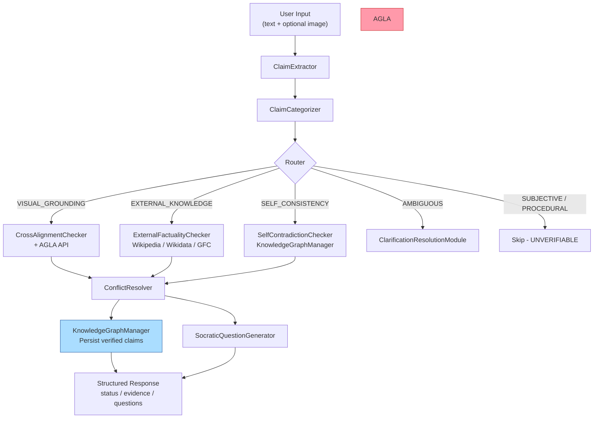
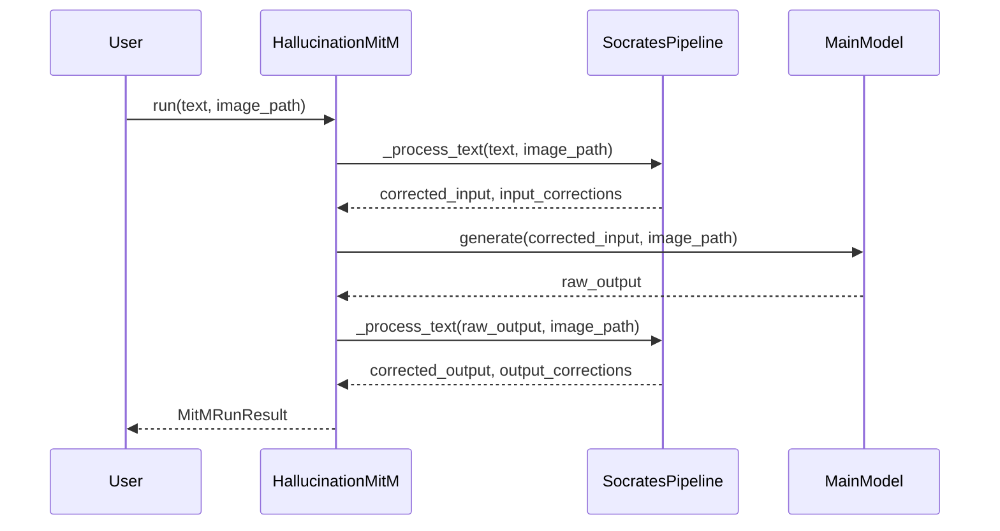

# Architecture

## System Overview

Socrates is a bidirectional hallucination detection and mitigation system for Multimodal Large Language Models (MLLMs). It intercepts textual (and optionally visual) input, decomposes it into atomic factual claims, routes each claim through the most appropriate verification pathway, and returns structured verdicts alongside Socratic dialogue questions.

The system operates in two modes:

- **Interactive / Flask mode**: `SocratesAgent` (in `core/socrates_agent.py`) receives HTTP requests and coordinates all modules in memory within a user session.
- **Batch / CLI mode**: `SocratesPipeline` (in `pipeline.py`) processes text from the command line, writes results to the terminal with ANSI color, and can persist session state across runs via `SOC_SESSION_ID`.

A third mode — the **Man-in-the-Middle (MitM) middleware** — wraps any main generative model for evaluation benchmarks. It applies the verification pipeline as a pre-processing step (to the user prompt) and a post-processing step (to the model output).

---

## Component Diagram

---

## Data Flow

### 1. Claim Extraction

`ClaimExtractor.extract_claims(text)` uses an LLM with the `claim_extraction.txt` prompt template to decompose the input into a JSON list of atomic claims. Each claim includes:
- `claim_text`, `confidence`, `entities`, optional `route_hint`, optional `vision_flag`

If the LLM is unavailable or fails, a rule-based regex fallback runs on spaCy sentence splits.

After parsing the JSON, a semantic similarity step (via `sentence-transformers`) maps each LLM-generated claim text back to the nearest source sentence, providing accurate character offsets (`start_char`, `end_char`) for span-level corrections.

### 2. Claim Categorization

`ClaimCategorizer.categorize_claim(claim)` calls the LLM with the `claim_categorisation.txt` prompt, returning one or more `ClaimCategoryType` enums per claim:

| Category | Verification Target |
|----------|-------------------|
| `VISUAL_GROUNDING_REQUIRED` | Cross-modal (image) |
| `EXTERNAL_KNOWLEDGE_REQUIRED` | External APIs (Wikipedia, Wikidata) |
| `SELF_CONSISTENCY_REQUIRED` | Session knowledge graph |
| `AMBIGUOUS_RESOLUTION_REQUIRED` | Clarification dialogue |
| `SUBJECTIVE_OPINION` | Skipped (unverifiable) |
| `PROCEDURAL_DESCRIPTIVE` | Skipped (unverifiable) |

A rule-based fallback applies when the LLM is unavailable.

### 3. Routing

Two routers are available and selectable via `SOC_ROUTER_MODE`:

- **`CheckRouter`** (LLM-based): direct category-to-method mapping with fixed priority rules. `VISUAL_GROUNDING_REQUIRED` and `EXTERNAL_KNOWLEDGE_REQUIRED` both route to `CROSS_MODAL` (for AGLA MME evaluation); `SELF_CONSISTENCY_REQUIRED` routes to `KNOWLEDGE_GRAPH`.
- **`DeterministicRouter`** (heuristic-based): incorporates KG coverage ratios, LLM-emitted `route_hint` fields, and `vision_flag` to score methods without an LLM call.
- **Hybrid mode**: both routers run; the `_route_claim` method in `SocratesPipeline` scores each result and selects the higher-confidence route.

### 4. Verification

Each claim is dispatched to the appropriate checker:

#### Cross-Modal (AGLA / CrossAlignmentChecker)

1. **Remote AGLA** (preferred): `AGLAClient.verify(image, claim, socratic_question)` sends a multipart POST to the configured `AGLA_API_URL`. Returns `{verdict: "True"|"False"|"Uncertain", truth, debug}`.
2. **Local CrossAlignmentChecker**: loads BLIP/LLaVA to caption the image and compute text-image semantic similarity. Falls back to this when AGLA is not configured.

#### External Factuality (ExternalFactualityChecker)

Queries up to four sources in sequence:
1. `WikipediaClient` (Wikipedia Search API + page extracts)
2. `WikidataClient` (wbsearchentities)
3. `GoogleFactCheckClient` (optional, requires API key)
4. Tavily fallback (optional, requires API key)
5. OpenAI fallback (optional, requires API key)

Results are aggregated by `_get_llm_factuality_verdict`, which formats all evidence + sources into the `factuality_verdict.txt` prompt and asks the LLM for a `TRUE | FALSE | INSUFFICIENT_EVIDENCE` verdict with confidence.

#### Self-Contradiction (SelfContradictionChecker)

Retrieves existing session claims from `KnowledgeGraphManager`, linearizes them via `GraphRAGFactFormatter`, and calls `LLMManager.detect_contradiction_simple_sync` to detect conflicts using the `CONTRADICTION_DETECTION_SIMPLE` task template.

### 5. Conflict Resolution

`ConflictResolver.resolve(claim, external_result, self_result)` applies evidence-weighted aggregation:
- Default weights: external factuality 0.6, self-consistency 0.4.
- Outputs a final `{status: PASS|FAIL|UNCERTAIN, confidence, should_add_to_kg, ...}`.
- In `manual` conflict mode, the pipeline prompts the user interactively on a TTY.

### 6. Clarification

`ClarificationResolutionModule.resolve_claim(ctx)` fires when:
- A claim is categorized as `AMBIGUOUS_RESOLUTION_REQUIRED` (pre-routing stage).
- A claim receives `FAIL` or `UNCERTAIN` from its checker and `post_factuality_clarification_enabled` is set (post-factuality stage).

The module generates issue-specific `SocraticQuestion` objects (from `question_generators.py`), optionally refines them with the LLM, and proposes a corrected claim text.

### 7. Knowledge Graph Persistence

Verified (`PASS`) claims are written to the session KG via `KnowledgeGraphManager.add_claim`. The KG uses:
- SQLite (`data/knowledge_graph.db`) for durable entity, relation, and claim records.
- In-memory NetworkX graph for fast session-level queries.
- Stable SHA-256 based entity IDs (`StableId`) for consistent cross-session deduplication.

---

## Middleware Mode (MitM)

The MitM applies minimal token-level edits: only the differing tokens within a claim's character span are replaced, preserving surrounding text. A polarity-flip guard prevents unintended negation changes (`SOC_ALLOW_POLARITY_FLIP=false` by default).

---

## Key Design Decisions

- **LLM-first with rule-based fallback** [inferred]: every NLP-heavy step (extraction, categorization, verdict aggregation) prefers an LLM call but gracefully degrades to deterministic rules when the LLM is unavailable. This ensures the system remains partially operational without any model server.

- **Remote-only AGLA policy**: when `AGLA_API_URL` is set, the system blocks startup until the remote service is ready (`app.py` calls `AGLAClient.wait_until_ready`). If the service is unreachable, Flask exits. [Note: `wait_until_ready` is called but not defined in the checked `agla_client.py` version — this may be present in a local override or an updated file not yet committed.]

- **Stable entity IDs**: `StableId` uses SHA-256 digests of normalized entity text + label, ensuring that the same real-world entity gets the same database row across sessions, enabling long-term contradiction detection.

- **Session-scoped KG**: each pipeline run creates a session UUID (or reuses `SOC_SESSION_ID`) and scopes all KG reads/writes to that session, preventing cross-user contamination in shared deployments.

- **Dual-handler logging**: `utils/logger.py` writes INFO+ to per-module log files under `logs/` and WARNING+ to the console, keeping terminal output quiet during normal operation.

- **Prompt templates as files**: all LLM prompts are stored as `.txt` files under `modules/prompt_templates/` and loaded at import time, making them easy to edit without touching Python source.
